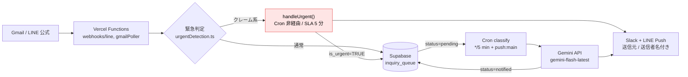

# AGENTS.md

AI コーディングエージェント向けの作業ルールです。人が読む資料は
[`docs/manual-operator.md`](docs/manual-operator.md)（運用マニュアル）と
[`docs/manual-developer.md`](docs/manual-developer.md)（開発者向け手順書）にあります。

このファイルは **「引き継いだ AI が最初に読む 1 枚」** として置いています。
Claude Code の場合は、起動後に次のように指示すれば読み込めます。

```
AGENTS.md と docs/manual-developer.md を読んで、現状を把握してから作業してください。
```

---

## このプロジェクトは何か

不動産管理会社向けのマルチチャネル通知システム。
Gmail・LINE 公式に届いた問い合わせを Slack へ自動集約し、
**Gemini API で 5 カテゴリに自動分類してチャネルへ振り分ける**。
クレーム検出時は営業部長の個人 LINE へ **5 分以内**に緊急通知する。

| レイヤー | 技術 |
|---|---|
| フレームワーク | Next.js 14（App Router） |
| DB | Supabase（PostgreSQL・RLS 有効） |
| AI | Gemini API（`gemini-flash-latest` エイリアス推奨・**バージョン固定は EOL リスク**） |
| Webhook 受信 | Vercel Functions |
| 定期実行 | **GitHub Actions Cron**（`.github/workflows/cron.yml`・PR #5/#6 で Vercel Cron から移行） |
| 通知 | Slack Web API・LINE Messaging API |
| デプロイ | Vercel（Git 連携・自動デプロイ有効） |
| 言語 | TypeScript（`any` 禁止） |

**本番 URL：** https://multichannel-notification-ai-dev.vercel.app/
**リポジトリ：** https://github.com/usako-ui/multichannel-notification-ai-dev

---

## 作業を始める前に読むもの

| 目的 | ファイル |
|---|---|
| まず動かす・全体像をつかむ | `docs/manual-developer.md` |
| 機能要件・DB スキーマ・受入条件 | `requirements.md` |
| AI 分類の検証シナリオと期待値 | `docs/case5-test-inquiries.csv`（テスト 22 件） |
| 環境変数の一覧 | `.env.example`（キー名）+ `docs/manual-developer.md`（用途・取得先） |

**⚠️ 本ファイル下部の「触ると壊れる箇所」は変更前に必ず読むこと。**

---

## 絶対に守ること

これを破ると、動いているように見えて壊れる。

### セキュリティ

- **Webhook は必ず署名検証を実装する。** LINE の HMAC-SHA256 検証をスキップしない
  - 署名検証なしで処理すると、外部から偽リクエストを投げて Slack・LINE を誤動作させられる
- **`external_id` には必ず UNIQUE 制約を維持する。** 削除・変更しない
  - Webhook はリトライがあるため UNIQUE がないと重複通知が発生する
- **API キーをコード・GitHub に書かない。** 環境変数のみで管理する
  - `NEXT_PUBLIC_` を付けない（付けた瞬間ブラウザに配信される）
  - `NEXT_PUBLIC_` は Supabase の URL と ANON_KEY のみに限定
- **緊急通知パス（`handleUrgent`）を Cron 経由に変更しない**
  - Cron は数分〜数十分の遅延があり得るため、SLA 5 分以内を超えるリスクがある
  - Webhook 内で同期呼び出しする現在の構造を維持する

### 設計

- AI 分類は `lib/classifyWithGemini.ts` に閉じる。他のファイルから直接 Gemini API を呼ばない
- 緊急キーワードは `requirements.md` / `lib/urgentDetection.ts` の正規表現定義を参照する。独自に変更しない
- Cron の 1 回あたりの取得件数は 20 件上限を維持する（レート制限・コスト超過防止）
- **transient エラー（5xx / 429 / タイムアウト）は `deferred` で pending 保持**（PR #8）
- permanent エラーのみ `status='failed'` にして再処理しない（無限ループ防止）

### コード

- `any` 型を使わない
- コメントは日本語で「なぜそうしたか」を書く
- エラーハンドリングを省略しない（try-catch・フォールバック必須）

---

## システムのデータフロー



- **緊急パス（赤）：** handleUrgent は Cron を経由せず Webhook 内で同期実行。SLA 5 分厳守。
- **通常パス：** Supabase pending → Cron → Gemini 分類 → Slack 投稿 → status=notified。
- **共通末端：** Slack + LINE Push は `送信元：LINE/Gmail｜送信者：XXX さん` フォーマット。

---

## 5 カテゴリ定義

| カテゴリ | 判定基準 | Slack チャネル | 環境変数 |
|---|---|---|---|
| 賃貸 | 賃貸物件への問い合わせ | `#賃貸` | `SLACK_CHANNEL_RENTAL` |
| 売買 | 購入・売却・査定 | `#売買` | `SLACK_CHANNEL_SALE` |
| 内見 | 内見・見学の日程調整 | `#内見` | `SLACK_CHANNEL_VIEWING` |
| クレーム | クレームかどうか迷う場合も含む（安全側） | `#クレーム緊急` | `SLACK_CHANNEL_COMPLAINT` |
| 要確認・その他 | 判断できないもの・迷惑メール等 | `#要確認` | `SLACK_CHANNEL_OTHER` |

### 緊急キーワード（正規表現・`lib/urgentDetection.ts`）
```typescript
const URGENT_PATTERN = /クレームです|苦情|至急|緊急対応|怒り/;
```
> ⚠️ **「緊急」単体は含めない**（「緊急ではありません」の誤検知防止・実機テストで検証済み）

---

## 環境の注意

- **Vercel Hobby プランの制約：** 定期 Cron は 1 日 1 回まで。**GitHub Actions に外部化して回避**（PR #5/#6）
- **Supabase 無料プランの制約：** 1 週間非活動でプロジェクトが一時停止する。週 1 回以上操作すること
- **LINE 無料プランの制約：** Push Message は月 200 通まで。クレームは月 75 件想定で範囲内
- **Gemini API 無料枠：** RPD 250 リクエスト/日・15 RPM。実測で 1 セッションのテスト連投で枯渇した実績あり

---

## 触ると壊れる箇所

**このセクションは本番リリースフェーズで判明した「変更すると連鎖的に壊れる箇所」を集約したものです。**
変更前に必ず読み、影響範囲を理解してから作業してください。

### 1. Next.js の fetch キャッシュ問題（`lib/supabase.ts`）

**症状：** Cron が pending 行を DB 更新後も「0 件」と返し続ける。同じ SELECT を別 endpoint で実行すると 1 件返る。

**原因：** `export const dynamic = "force-dynamic"` は Route Handler のプリレンダリング挙動を制御するだけで、**Supabase JS 内部の `fetch` は Next.js のデフォルトキャッシュに引っかかる**。

**対策：** `lib/supabase.ts` の `supabaseAdmin` で `global.fetch` を差し替え、すべての Supabase リクエストに `cache: "no-store"` を強制する。

```typescript
// lib/supabase.ts（正しい実装）
export function supabaseAdmin() {
  return createClient(url, serviceRoleKey, {
    global: {
      fetch: (input, init) => fetch(input, { ...init, cache: "no-store" }),
    },
  });
}
```

> ⚠️ **絶対に触ってはいけないコード：** 上記の `global.fetch` 差し替え部分。削除・簡略化すると Cron 全体が壊れる。
> **PR #7 で導入・本番リリース時の障害で長時間デバッグの末に判明した根本原因。**

---

### 2. Windows CRLF 問題（Vercel CLI で env を投入するとき）

**症状：** `.env.local` から値を grep で取り出して `vercel env add` に pipe すると、Vercel に保存された値で API 認証が通らない。

**原因：** Windows の `.env.local` は改行が **CRLF (`\r\n`)**。`tr -d '\n'` では `\r` が残り、Vercel に「値 + `\r`」で保存される。トークンが 1 文字ズレて認証失敗する。

**対策：** **必ず `tr -d '\r\n'` を使う**（`\r` と `\n` 両方を除去）。

```bash
# ❌ 悪い例（\r が残る・Slack 障害復旧テストで復元失敗の原因になった）
grep "^SLACK_BOT_TOKEN=" .env.local | cut -d= -f2- | tr -d '\n' | vercel env add SLACK_BOT_TOKEN production

# ✅ 良い例
grep "^SLACK_BOT_TOKEN=" .env.local | cut -d= -f2- | tr -d '\r\n' | vercel env add SLACK_BOT_TOKEN production
```

> ⚠️ **絶対に触ってはいけない箇所：** env 投入スクリプトを書くとき、Windows 開発環境を想定する。macOS/Linux 用と差別化する必要がある。

---

### 3. Gemini EOL 問題（`lib/classifyWithGemini.ts`）

**症状：** ある日から Gemini 呼び出しが全件 404 で失敗し始める。

**原因：** Gemini モデルの **具体的バージョン（例：`gemini-2.5-flash`）は EOL（End Of Life）**で提供終了される。新規ユーザーからのアクセスは即 404 を返す（既存ユーザー継続の場合もある）。

**対策：** **必ずエイリアス `gemini-flash-latest` を使う**。Google が管理する最新安定 flash モデルへ自動追随される。

```typescript
// lib/classifyWithGemini.ts（正しい実装）
const model = process.env.GEMINI_MODEL || "gemini-flash-latest";
```

```bash
# .env / Vercel env（推奨）
# GEMINI_MODEL 未設定またはコメントアウト
# → コード内デフォルト gemini-flash-latest が使われる
```

> ⚠️ **絶対にやってはいけない：** `GEMINI_MODEL=gemini-2.5-flash` のようにバージョン固定する。
> **PR #7 で対応・本番リリース時の障害で発覚。**

---

### 4. Vercel env 変数キャッシュ（変更後は必ず Redeploy 必須）

**症状：** Vercel Dashboard で env を更新して Save したが、Function は古い値を使い続けている。

**原因：** Vercel Serverless Function は **ウォームコンテナが env を保持し続ける**。新しい env は次のコールドスタート時にしか読み込まれない。

**対策：** env 変更後は必ず以下のどちらかを実行する。

```bash
# 方法1（推奨・CLI）
vercel --prod --yes

# 方法2（Vercel Dashboard）
Deployments → 最新デプロイ → 「⋯」→ Redeploy
```

> ⚠️ **忘れがち：** 「保存したから反映されているはず」と思い込むと、後続のテストで謎のエラーが延々続く。
> **Slack 障害復旧テストで検出**。

---

### 5. GitHub Actions schedule 遅延（`.github/workflows/cron.yml`）

**症状：** `cron: "*/5 * * * *"` と書いてあるのに、5 分毎に発火しない。数時間〜半日発火しないことがある。

**原因：** GitHub Actions の `schedule` トリガーは **リポジトリが非アクティブ時に大幅遅延する既知の挙動**。GitHub 公式ドキュメントにも「高負荷時に schedule はスキップされることがある」と明記されている。

**対策：** **`push: main` トリガーを併設する**（PR #9 で追加済み）。

```yaml
# .github/workflows/cron.yml（現状の実装）
on:
  schedule:
    - cron: "*/5 * * * *"
  workflow_dispatch:      # 手動発火
  push:                   # main へのマージで自動発火
    branches:
      - main
```

**運用時の意味：**
- 通常時：`push: main` トリガーで PR マージのたびに 1 回発火
- 手動確認したいとき：`gh workflow run cron.yml` で明示発火
- schedule は「あわよくば」で頼らない

> ⚠️ **絶対にやってはいけない：** `push` トリガーを外して schedule だけに戻す。緊急通知は即時 Webhook 経由なので影響しないが、通常パスの Slack 投稿が数時間遅延する。

---

### 6. LINE Webhook のリトライと冪等性（`handleUrgent.ts:57-59`）

**症状：** 同じクレームが Slack に複数投稿される・LINE Push が複数回営業部長に届く。

**原因の可能性：** LINE Webhook のリトライ挙動と、`23505 unique_violation` の握りつぶし忘れ。

**対策：** すべての INSERT パスで `23505` を **early return** する（重複時は Slack 投稿・LINE Push もスキップ）。

```typescript
// lib/handleUrgent.ts（正しい実装）
const { error } = await supabase.from("inquiry_queue").insert({ ... });
if (error) {
  if (error.code === "23505") return; // 重複＝正常系・即 return
  throw new Error(`緊急パス INSERT 失敗: ${error.message}`);
}
// この行以降で Slack 投稿と LINE Push を実行
```

> ⚠️ **触ってはいけない箇所：** early `return` を削除すると、Webhook リトライのたびに Slack + LINE に重複通知が飛ぶ。冪等性テストで検証済み。

---

### 7. `docs/manual-developer.md` セクション 8 のトラブルシュート

同じ症状が再発したときに参照する。**上記 1〜6 は開発者向けにも解説あり**：

- Vercel env キャッシュ問題 → §8「Vercel 環境変数を変更したのに反映されない」
- Windows CRLF 問題 → §8「Windows 環境で vercel env add に値をパイプすると壊れる」
- Gemini quota → §8「Gemini API が deferred を返し続ける」
- デプロイ待ちタイミング → §8「Vercel デプロイ完了直後の Webhook が失敗する」

---

## 環境変数

`.env.example` にキー名の一覧があります（全 18 件）。値は引き渡し元に確認してください。
詳細は `docs/manual-developer.md` の「3. 環境変数の投入手順」を参照。

---

## リポジトリに含まれないもの

| 必要なもの | 用途と代替手段 |
|---|---|
| **環境変数の実値** | 起動に必須。キー名は `.env.example` にある。値は管理者に確認する |
| **Slack Bot Token** | Slack App 設定から再発行できる |
| **LINE Channel Secret / Access Token** | LINE Developers から確認・再発行できる |
| **Gemini API キー** | Google AI Studio から再発行できる（無料） |

> 上記が揃わなくても、コードの変更・型チェック・Lint・ビルドは実行できる。
> **「ファイルが無い」で止まらず、できるところまで進めて、何が無くて何ができなかったかを報告すること。**

---

## 作業の進め方

1. **変更前に、何をどう変えるかを説明する。** いきなり書き換えない
2. 影響範囲を確認する（特に「絶対に守ること」「触ると壊れる箇所」に触れるか）
3. 実装する
4. 型チェック・ビルドを通す

```bash
npx tsc --noEmit      # 型チェック
npx next build        # ビルド確認（型検証含む）
# ※ npx next lint は本プロジェクトで未設定
```

5. 動作を確認する。確認できていないことを「できた」と書かない
6. 変更を PR にする。1 PR で 1 目的（トピックを混ぜない）

---

## API キーローテーション手順

キーが漏洩した場合の対応手順は `docs/manual-developer.md` §9「APIキーローテーション手順」を参照してください。
各サービスのキー再発行後、Vercel の環境変数を更新 → **必ず Redeploy**（触ると壊れる箇所 #4 参照）してください。
