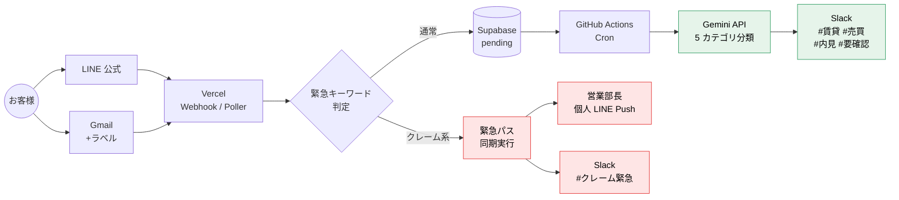

# MultiChannel Notify — マルチチャネル通知 + AI 自動分類システム

> 不動産管理会社向けに、**LINE 公式 + Gmail の問い合わせを Slack に自動集約**し、
> Gemini で 5 カテゴリに自動分類。クレームは営業部長の個人 LINE に **5 分以内**で通知します。

**本番 URL：** https://multichannel-notification-ai-dev.vercel.app/
**AI デモ体験（BYOK）：** 上記 URL からご自身の Gemini API キーで即体験可能

---

## このプロジェクトが解決すること

### 課題（現場の困りごと）

- **受信トレイを毎日ハシゴ：** LINE 公式・Gmail を個別確認。営業時間外の LINE が朝には他連絡に埋もれて見落とし発生
- **クレーム対応が半日遅れる：** 「エアコンが効かない」等の緊急連絡を営業部長が気づくまで数時間。SLA 未達がクライアント満足度に直結
- **誰が対応中か分からない：** スタッフ間で「これ返信した？」の確認が発生。同じお客様に複数スタッフが返信して信頼を失う

### 解決策

1. **マルチチャネル集約：** LINE 公式・Gmail の問い合わせを Slack の 5 チャネルへ自動振り分け
2. **AI 自動分類：** Gemini API が問い合わせを賃貸・売買・内見・クレーム・要確認の 5 カテゴリへ自動判定
3. **緊急通知（SLA 5 分以内）：** クレーム検出時は Cron を経由せず Webhook 同期実行で営業部長の個人 LINE に即 Push

---

## システムアーキテクチャ



**設計思想：**
- **緊急パスは Cron を経由しない**（赤経路・Cron 遅延で SLA 5 分を超えるリスクを排除）
- **通常パスは Cron 経由**（緑経路・Gemini API のレート制限をキュー吸収）
- **Supabase RLS + service_role キー分離**でセキュリティ多層化

---

## 主な機能

| 機能 | 実装 | 検証結果 |
|---|---|---|
| **緊急クレーム 5 分 SLA** | Webhook 同期実行・Cron 非経由 | ✅ **3 回連続 1 分未満達成** |
| **AI 5 カテゴリ分類** | Gemini `gemini-flash-latest` | ✅ **22/22 = 100% 分類精度**（22 パターンの実機テスト） |
| **ノイズ耐性** | プロンプト設計 + Fail-safe | ✅ 「今日の天気」等の無関係な文を「要確認・その他」に正解分類 |
| **誤検知防止** | URGENT_PATTERN 設計 | ✅ 「緊急ではありません」を通常パスへ流す（否定表現の適切な処理） |
| **冪等性保証** | `external_id` UNIQUE + 23505 handling | ✅ 全経路で重複通知を排除 |
| **Slack 障害復旧** | 3 回リトライ + LINE Push アラート | ✅ アラートは非エンジニアが即対応可能な日本語 |
| **送信者名表示** | LINE Profile API / Gmail From ヘッダ | ✅ Slack 投稿に「送信元：LINE｜送信者：山田太郎さん」を付与 |

---

## 技術スタック

### コア

| レイヤー | 技術 | 選定理由 |
|---|---|---|
| フレームワーク | **Next.js 14**（App Router） | Vercel Functions と Route Handler で低運用コスト |
| 言語 | **TypeScript** | `any` 禁止・型安全設計で 6 万行規模でも保守可 |
| DB | **Supabase**（PostgreSQL・RLS 有効） | 無料枠 + 認証済み・マネージド RLS |
| AI | **Google Gemini API**（`gemini-flash-latest`） | 日本語処理精度が高い・無料枠でプロトタイプ可 |
| Webhook | **Vercel Functions** | Cold start が早く、Webhook 応答制限（LINE 30 秒）内 |
| 定期実行 | **GitHub Actions Cron**（5 分毎 + push:main） | Vercel Hobby プランの Cron 制約回避 |
| 通知 | **Slack Web API** + **LINE Messaging API** | 業務浸透度の高さ + 個人 LINE Push の即時性 |
| デプロイ | **Vercel**（Git 連携・自動 CI/CD） | PR マージで自動デプロイ・プレビュー環境完備 |

### 開発ツール

| 用途 | ツール |
|---|---|
| バージョン管理 | Git + GitHub |
| CI/CD | GitHub Actions（型検査・ビルド・デプロイトリガー） |
| DB マイグレーション | Supabase MCP + `supabase/migrations/` |
| スタイル | Tailwind CSS v3 + Inter フォント（`next/font`） |
| アイコン | Lucide React |
| 環境変数管理 | Vercel Env + `.env.local`（開発） |

---

## デモ体験

本番 LP から **BYOK（Bring Your Own Key）** 方式で AI 分類を体験できます。

1. https://multichannel-notification-ai-dev.vercel.app/ の「デモを試す」セクションへ
2. ご自身の Gemini API キー（[Google AI Studio](https://aistudio.google.com/apikey) で無料取得可）を入力
3. 4 種類のサンプル（賃貸・売買・内見・クレーム）または自由入力で分類結果を確認

**セキュリティ：**
- API キーはブラウザから **直接 Google に送信**され、当サイトのサーバーには保存されません
- 入力本文・分類結果も一切ログ収集しません（Client Side のみで完結）

---

## セットアップ（引き継ぎ開発者向け）

詳細な手順は [`docs/manual-developer.md`](docs/manual-developer.md) を参照してください。

```bash
# 1. リポジトリをクローン
git clone https://github.com/usako-ui/multichannel-notification-ai-dev.git
cd multichannel-notification-ai-dev

# 2. 依存関係インストール
npm install

# 3. 環境変数設定（18 件）
cp .env.example .env.local
# .env.local を編集して値を設定
# 詳細な取得手順は docs/manual-developer.md §3 を参照

# 4. ローカル起動
npm run dev
# http://localhost:3000

# 5. 型チェック・ビルド
npx tsc --noEmit
npx next build
```

---

## ドキュメント構成

| ファイル | 対象読者 | 内容 |
|---|---|---|
| **`README.md`**（本ファイル）| 採用担当者・クライアント | プロジェクト概要・特徴・技術スタック |
| **`AGENTS.md`** | AI エージェント・新規開発者 | 引き継ぎルール + **触ると壊れる箇所 7 項目** |
| **`docs/manual-developer.md`** | 引き継ぎ開発者 | セットアップ・デプロイ・環境変数・トラブルシュート |
| **`docs/manual-operator.md`** | 営業部長・現場スタッフ | Slack の使い方・緊急通知の意味・トラブル判断 |
| **`requirements.md`** | 開発者・ステークホルダー | 機能要件・DB スキーマ・受入条件（AC-001〜AC-014） |

---

## 開発期間

**2026 年 9 月 10 日〜9 月 14 日（実働 5 日間・全 7 フェーズ）**

| Phase | 内容 |
|---|---|
| 1 | Next.js + Supabase 基盤・DB スキーマ・環境変数設計 |
| 2 | LINE Webhook・署名検証・Gmail Poller・緊急判定ロジック |
| 3 | Gemini 分類・Slack 投稿・Cron 統合 |
| 4 | 緊急 LINE Push・SLA 設計・品質レビュー対応 |
| 5 | Vercel 本番デプロイ・E2E 動作確認・障害対応 |
| 6 | SLA 実機テスト・分類精度テスト・冪等性・Slack 再送検証 |
| 7 | 運用マニュアル・LP + BYOK デモ・ダーク SaaS UI リニューアル |

**開発プロセス：** 機能ごとに PR を分割し 17 本のマージ・レビューサイクルで進行

**使用ツール：**
- Claude Code（AI 駆動開発）
- Cursor（コードレビュー）
- Vercel CLI・GitHub CLI（gh）
- Supabase MCP（DB 操作・マイグレーション）

---

## セキュリティ設計のハイライト

- **LINE Webhook：** HMAC-SHA256 + `crypto.timingSafeEqual` によるタイミング攻撃耐性
- **Cron エンドポイント：** Bearer 認証（`CRON_SECRET`）で保護
- **Supabase：** RLS 有効 + `service_role` キーはサーバー専用（ブラウザは `anon` のみ）
- **API キー管理：** `.env.local` は `.gitignore` 対象・`NEXT_PUBLIC_` は Supabase の URL/ANON のみ
- **BYOK デモ：** API キーはブラウザから直接 Google へ・サーバー保存なし
- **Slack 障害時：** 3 回リトライ後に営業部長 LINE へアラート（Slack 自己参照回避）

---

## 注意事項

**本プロジェクトは架空の不動産管理会社を想定した模擬案件（ポートフォリオ）です。**
実運用を目的とした利用ではありません。

- Supabase・Slack・LINE 公式・Gmail のテスト環境は開発期間のみ稼働
- 本番 URL（LP + BYOK デモ）はポートフォリオ用に公開継続

---

## 開発者

- **usako-ui**
- ポートフォリオ：https://misako-profile-portfolio.vercel.app/
- 業務相談（LINE 公式）：https://line.me/R/ti/p/@745jejoa

**AI 駆動開発の実践：**
本プロジェクトは Claude Code をメインの開発パートナーとして、設計〜実装〜レビュー〜デプロイまで一貫した AI 駆動開発で構築しました。
実案件相当の設計品質・セキュリティ・保守性を短期間で実現することを目指しています。

---

## ライセンス

[MIT License](./LICENSE) で公開しています。

商用・非商用問わず、コードの利用・改変・再配布が可能です。
コピー・改変時は LICENSE ファイルの著作権表示を残してください（MIT 標準の条件）。

**利用例：** 実装の参考にする / 派生プロジェクトを立てる / 一部のロジック（例：LINE 署名検証、Gemini transient retry、fetch キャッシュ回避パターン）を業務で使う など。
