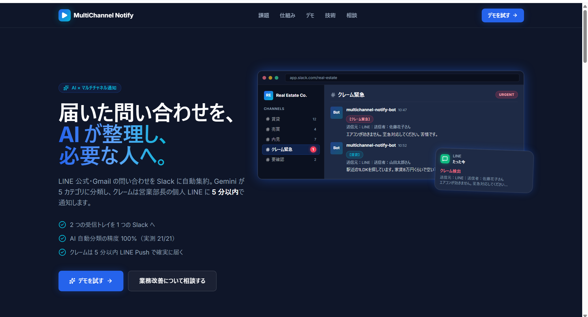
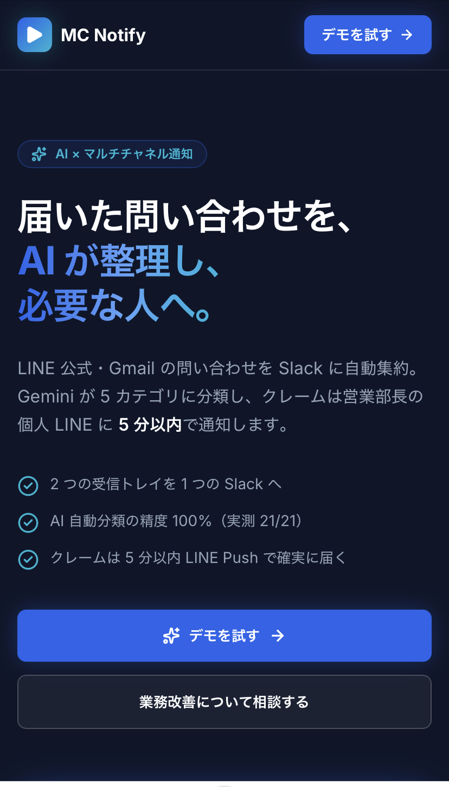
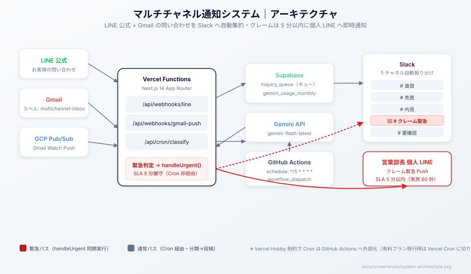
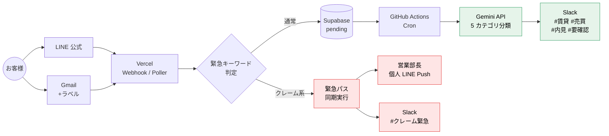

# MultiChannel Notify — マルチチャネル通知 + AI 自動分類システム

> 不動産管理会社向けに、**LINE 公式 + Gmail の問い合わせを Slack に自動集約**し、
> Gemini で 5 カテゴリに自動分類。クレームは営業部長の個人 LINE に **5 分以内**で通知します。

**本番 URL：** https://multichannel-notification-ai-dev.vercel.app/
>**AI デモ体験（BYOK）：** 上記 URL からご自身の Gemini API キーで即体験可能

<table>
  <tr>
    <td align="center" valign="middle">
      <br>
      <sub> <b>PC 表示</b>（1920×1035）</sub>
    </td>
    <td align="center" valign="middle">
      <br>
      <sub> <b>モバイル表示</b>（iPhone 14 Pro）</sub>
    </td>
  </tr>
</table>

**モバイルファースト設計：** Tailwind CSS で `sm:` プレフィックスを 200+ 箇所使用し、スマホ実機でもレイアウトが崩れずに閲覧できることを目視確認済み。

---

## 📌 本ポートフォリオの前提について

元となる模擬案件の提案書では **Vercel 有料プラン（Pro）** を想定しており、その場合 Vercel Cron が実質無制限に使えるため `/api/cron/classify` は Vercel Cron のみでシンプルに構成できます。

一方、**本ポートフォリオ実装は個人の無料開発環境（Vercel Hobby）** で構築するという制約があるため、Hobby プランの Cron 制約（各 Cron は 1 日 1 回まで）を回避する目的で **GitHub Actions Cron へ外部化** しています。この構成差はコード側で吸収されており、SLA 5 分厳守が求められるクレーム経路は Webhook / Pub/Sub Push で処理されるため実運用上の影響はありません。

**実運用時（有料プラン移行時）の切り戻し手順：**
- `.github/workflows/cron.yml` を削除
- `vercel.json` に `crons` 設定を追加（例：`"crons": [{ "path": "/api/cron/classify", "schedule": "*/5 * * * *" }]`）
- アプリコードの変更は不要

---

## このプロジェクトが解決すること

### 課題（現場の困りごと）

- **受信トレイを毎日ハシゴ：** LINE 公式・Gmail を個別確認。営業時間外の LINE が朝には他連絡に埋もれて見落とし発生
- **クレーム対応が半日遅れる：** 「エアコンが効かない」等の緊急連絡を営業部長が気づくまで数時間。SLA 未達がクライアント満足度に直結
- **誰が対応中か分からない：** スタッフ間で「これ返信した？」の確認が発生。同じお客様に複数スタッフが返信して信頼を失う

### 解決策

1. **マルチチャネル集約：** LINE 公式・Gmail の問い合わせを Slack の 5 チャネルへ自動振り分け
2. **AI 自動分類：** Gemini API が問い合わせを賃貸・売買・内見・クレーム・要確認の 5 カテゴリへ自動判定
3. **緊急通知（SLA 5 分以内）：** クレーム検出時は Cron を経由せず Webhook 同期実行で営業部長の個人 LINE に即 Push

---

## システムアーキテクチャ



**主要コンポーネント：** LINE / Gmail の受信 → Vercel Functions（3 エンドポイント）→ Supabase キュー → Gemini 分類 → Slack 5 チャネル振り分け。緊急パスは Cron を経由せず handleUrgent で同期実行し、営業部長個人 LINE へ数秒で到達（実測 60 秒以内）。

<details>
<summary>Mermaid フローチャート（テキスト検索可能な等価図）</summary>



</details>

**設計思想：**
- **緊急パスは Cron を経由しない**（赤経路・Cron 遅延で SLA 5 分を超えるリスクを排除）
- **通常パスは Cron 経由**（緑経路・Gemini API のレート制限をキュー吸収）
- **Supabase RLS + service_role キー分離**でセキュリティ多層化

---

## 主な機能

| 機能 | 実装 | 検証結果 |
|---|---|---|
| **緊急クレーム 5 分 SLA** | Webhook 同期実行・Cron 非経由 | ✅ **3 回連続 1 分未満達成** |
| **AI 5 カテゴリ分類** | Gemini `gemini-flash-latest` | ✅ **22/22 = 100% 分類精度**（22 パターンの実機テスト） |
| **ノイズ耐性** | プロンプト設計 + Fail-safe | ✅ 「今日の天気」等の無関係な文を「要確認・その他」に正解分類 |
| **誤検知防止** | URGENT_PATTERN 設計 | ✅ 「緊急ではありません」を通常パスへ流す（否定表現の適切な処理） |
| **冪等性保証** | `external_id` UNIQUE + 23505 handling | ✅ 全経路で重複通知を排除 |
| **Slack 障害復旧** | 3 回リトライ + LINE Push アラート | ✅ アラートは非エンジニアが即対応可能な日本語 |
| **送信者名表示** | LINE Profile API / Gmail From ヘッダ | ✅ Slack 投稿に「送信元：LINE｜送信者：山田太郎さん」を付与 |

---

## 技術スタック

### コア

| レイヤー | 技術 | 選定理由 |
|---|---|---|
| フレームワーク | **Next.js 14**（App Router） | Vercel Functions と Route Handler で低運用コスト |
| 言語 | **TypeScript** | `any` 禁止・型安全設計で 6 万行規模でも保守可 |
| DB | **Supabase**（PostgreSQL・RLS 有効） | 無料枠 + 認証済み・マネージド RLS |
| AI | **Google Gemini API**（`gemini-flash-latest`） | 日本語処理精度が高い・無料枠でプロトタイプ可 |
| Webhook | **Vercel Functions** | Cold start が早く、Webhook 応答制限（LINE 30 秒）内 |
| 定期実行 | **GitHub Actions Cron**（5 分毎 + push:main） | Vercel Hobby プランの Cron 制約回避 |
| 通知 | **Slack Web API** + **LINE Messaging API** | 業務浸透度の高さ + 個人 LINE Push の即時性 |
| デプロイ | **Vercel**（Git 連携・自動 CI/CD） | PR マージで自動デプロイ・プレビュー環境完備 |

### 開発ツール

| 用途 | ツール |
|---|---|
| バージョン管理 | Git + GitHub |
| CI/CD | GitHub Actions（型検査・ビルド・デプロイトリガー） |
| DB マイグレーション | Supabase MCP + `supabase/migrations/` |
| スタイル | Tailwind CSS v3 + Inter フォント（`next/font`） |
| アイコン | Lucide React |
| 環境変数管理 | Vercel Env + `.env.local`（開発） |

---

## デモ体験

本番 LP から **BYOK（Bring Your Own Key）** 方式で AI 分類を体験できます。

1. https://multichannel-notification-ai-dev.vercel.app/ の「デモを試す」セクションへ
2. ご自身の Gemini API キー（[Google AI Studio](https://aistudio.google.com/apikey) で無料取得可）を入力
3. 4 種類のサンプル（賃貸・売買・内見・クレーム）または自由入力で分類結果を確認

**セキュリティ：**
- API キーはブラウザから **直接 Google に送信**され、当サイトのサーバーには保存されません
- 入力本文・分類結果も一切ログ収集しません（Client Side のみで完結）

---

## 定期実行（GitHub Actions External Cron）

Vercel Hobby プランの Cron 制約（各 Cron は 1 日 1 回まで）を回避するため、GitHub Actions から `/api/cron/classify` を定期実行しています（`.github/workflows/cron.yml`）。

### トリガー戦略（3 段構え・信頼性順）

| # | トリガー | 信頼性 | 用途 |
|---|---|---|---|
| 1 | `workflow_dispatch`（手動） | ✅ 最も確実 | **正式な動作確認手段**・ポートフォリオ用途で運用者が明示発火 |
| 2 | `push: main`（PR マージ時） | ✅ 確実 | main への push で必ず 1 回発火・開発中の PR マージがそのまま Cron 発火として機能 |
| 3 | `schedule: "*/5 * * * *"` | 🟡 ベストエフォート | GitHub Actions の schedule は **リポジトリ非アクティブ時に数時間〜数日遅延・スキップされる**既知挙動あり |

### 手動発火手順（推奨）

**GitHub Actions UI から：**
1. リポジトリの Actions タブを開く
2. 左メニュー「External Cron」を選択
3. 「Run workflow」ボタン → main ブランチ → Run

**または GitHub CLI から：**
```bash
gh workflow run cron.yml
```

### SLA への影響

- **緊急 LINE Push（クレーム SLA 5 分以内）**：LINE Webhook 内で同期実行されるため、この Cron の遅延は SLA に影響しない
- **通常メッセージの Slack 投稿**：schedule 遅延の影響を受ける可能性あり
- 運用者は「投稿が遅い」と感じたら `workflow_dispatch` で明示発火する

---

## セットアップ（引き継ぎ開発者向け）

詳細な手順は [`docs/manual-developer.md`](docs/manual-developer.md) を参照してください。

```bash
# 1. リポジトリをクローン
git clone https://github.com/usako-ui/multichannel-notification-ai-portfolio.git
cd multichannel-notification-ai-portfolio

# 2. 依存関係インストール
npm install

# 3. 環境変数設定（18 件）
cp .env.example .env.local
# .env.local を編集して値を設定
# 詳細な取得手順は docs/manual-developer.md §3 を参照

# 4. ローカル起動
npm run dev
# http://localhost:3000

# 5. 型チェック・ビルド
npx tsc --noEmit
npx next build
```

---

## ドキュメント一覧

用途と読者ごとに分割しています。まずここから該当ドキュメントへ移動してください。

| ドキュメント | 対象読者 | 内容 |
|---|---|---|
| [プロジェクト概要](project-overview.md) | 全員（採用担当・クライアント・開発者）| 背景・現状課題・データフロー・技術選定 |
| [要件定義書](requirements.md) | 開発者・ステークホルダー | 機能要件（F-01〜F-13）・DB スキーマ・受入条件（AC-001〜AC-015）・環境変数一覧 |
| [運用マニュアル（詳細版）](docs/manual-operator.md) | 営業部長・現場スタッフ | 日常確認・緊急対応・トラブル判断・監視 SQL |
| [運用マニュアル（A4 印刷版）](docs/manual-operator-print.html) | 現場配布・掲示用 | A4 縦 1 枚で完結する日常運用の要点だけ |
| [開発者向け手順書（詳細版）](docs/manual-developer.md) | 引き継ぎ開発者 | セットアップ・デプロイ・環境変数投入・API キーローテーション・トラブルシュート |
| [開発者向け QuickRef](docs/manual-developer-quickref.md) | 開発者（作業中）| エンドポイント対応表・環境変数マトリクス・トラブル判断フロー・デプロイ前チェックリスト |
| [AGENTS.md（設計判断集）](AGENTS.md) | 引き継ぎ開発者・AI エージェント | 触ると壊れる箇所 10 項目・変更前に必ず読む設計判断 |

**すぐに参照したい用途別ショートカット：**

- 🖥️ **本番の動作イメージを見たい** → [デモ体験](#デモ体験)
- 🚨 **クレーム通知が届かない時どうする？** → [運用マニュアル 障害対応節](docs/manual-operator.md)
- 🛠️ **セットアップから始めたい** → [開発者向け手順書](docs/manual-developer.md)
- ⚡ **障害対応中で判断フローが欲しい** → [開発者 QuickRef](docs/manual-developer-quickref.md)
- 🔒 **コード変更前に確認したい** → [AGENTS.md 触ると壊れる箇所](AGENTS.md#触ると壊れる箇所)

---

## 開発期間

**2026 年 9 月 10 日〜9 月 16 日（実働 5 日間・全 7 フェーズ）**

| Phase | 内容 |
|---|---|
| 1 | Next.js + Supabase 基盤・DB スキーマ・環境変数設計 |
| 2 | LINE Webhook・署名検証・Gmail Poller・緊急判定ロジック |
| 3 | Gemini 分類・Slack 投稿・Cron 統合 |
| 4 | 緊急 LINE Push・SLA 設計・品質レビュー対応 |
| 5 | Vercel 本番デプロイ・E2E 動作確認・障害対応 |
| 6 | SLA 実機テスト・分類精度テスト・冪等性・Slack 再送検証 |
| 7 | 運用マニュアル・LP + BYOK デモ・ダーク SaaS UI リニューアル |

**開発プロセス：** 機能ごとに PR を分割し 17 本のマージ・レビューサイクルで進行

**使用ツール：**
- Claude Code（AI 駆動開発）
- Cursor（コードレビュー）
- Vercel CLI・GitHub CLI（gh）
- Supabase MCP（DB 操作・マイグレーション）

---

## セキュリティ設計のハイライト

- **LINE Webhook：** HMAC-SHA256 + `crypto.timingSafeEqual` によるタイミング攻撃耐性
- **Cron エンドポイント：** Bearer 認証（`CRON_SECRET`）で保護
- **Supabase：** RLS 有効 + `service_role` キーはサーバー専用（ブラウザは `anon` のみ）
- **API キー管理：** `.env.local` は `.gitignore` 対象・`NEXT_PUBLIC_` は Supabase の URL/ANON のみ
- **BYOK デモ：** API キーはブラウザから直接 Google へ・サーバー保存なし
- **Slack 障害時：** 3 回リトライ後に営業部長 LINE へアラート（Slack 自己参照回避）

---

## 注意事項

**本プロジェクトは架空の不動産管理会社を想定した模擬案件（ポートフォリオ）です。**
実運用を目的とした利用ではありません。

- Supabase・Slack・LINE 公式・Gmail のテスト環境は開発期間のみ稼働
- 本番 URL（LP + BYOK デモ）はポートフォリオ用に公開継続

---

## 開発者

- **usako-ui**
- [ポートフォリオ](https://misako-profile-portfolio.vercel.app/)
- [業務相談（LINE 公式）](https://line.me/R/ti/p/@745jejoa)

**AI 駆動開発の実践：**
本プロジェクトは Claude Code をメインの開発パートナーとして、設計〜実装〜レビュー〜デプロイまで一貫した AI 駆動開発で構築しました。
実案件相当の設計品質・セキュリティ・保守性を短期間で実現することを目指しています。

---

## ライセンス

本リポジトリのコードは **ポートフォリオ目的**で公開しています。詳細は [LICENSE](./LICENSE) を参照してください。

**許可：** コードの閲覧・参照・学習目的での利用
**禁止：** 商用利用・無断複製/再配布・本コードをベースにした製品/サービス開発

商用利用・導入検討・コラボレーションについては、 [LINE 公式アカウント](https://line.me/R/ti/p/@745jejoa) までご相談ください。
