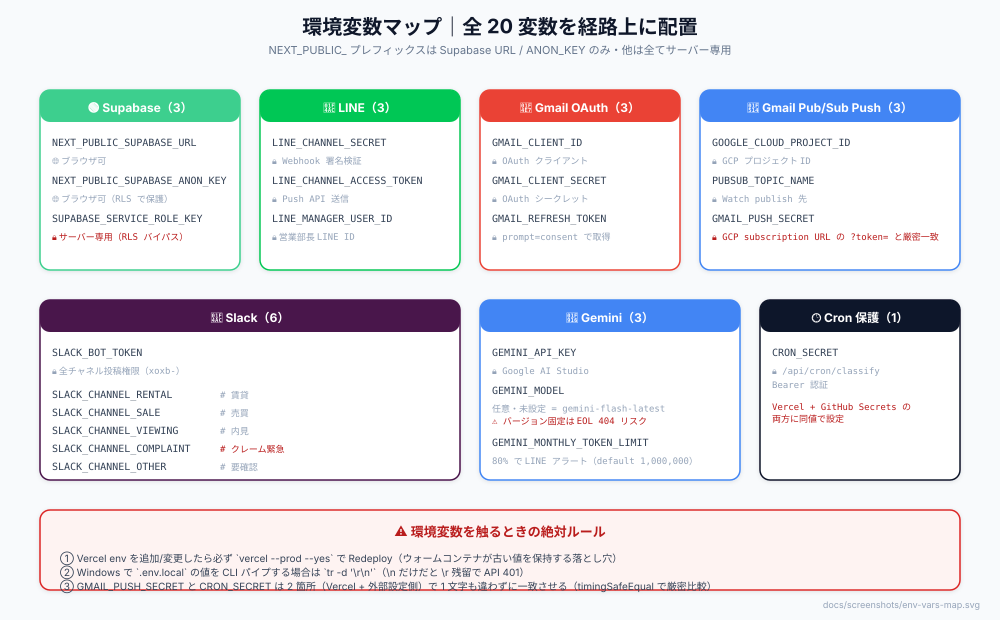
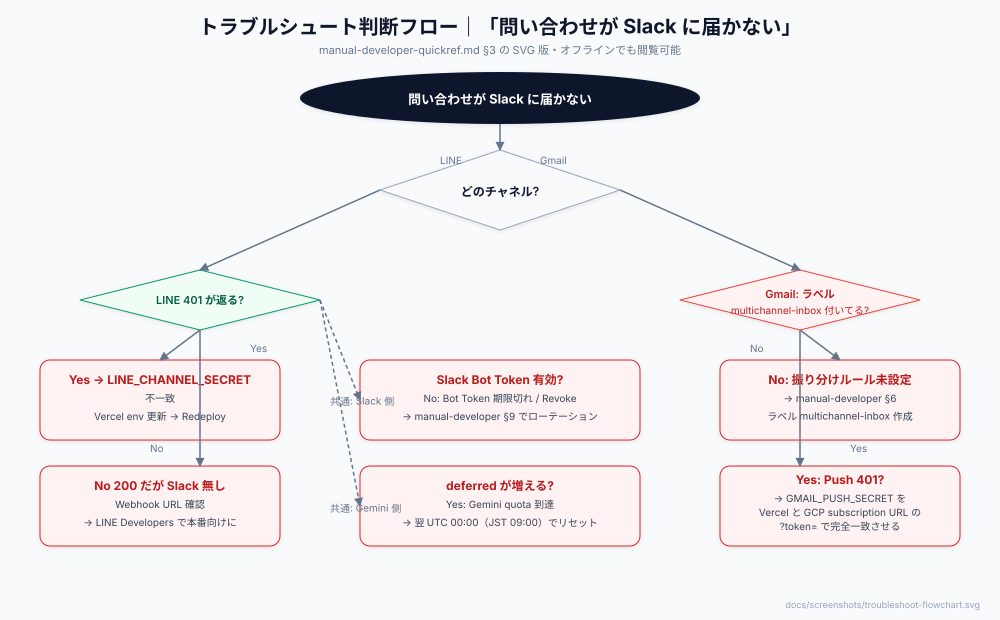
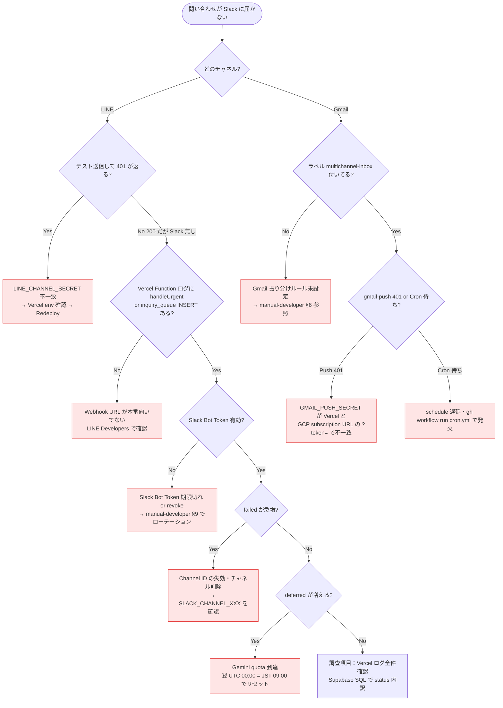

# 開発者向けクイックリファレンス（QuickRef）

**用途：** 作業中にパッと見る要点集約。詳細手順は [`manual-developer.md`](./manual-developer.md) を参照。
**想定シーン：** 障害対応中に「今すぐ何を確認すべきか」を判断する / デプロイ前に「絶対に忘れてはいけないこと」をチェックする / 新規参画者が「まず何がどこにあるか」を掴む。

---

## 1. エンドポイント対応表（見るですべて分かる）

| Path | Method | 認証 | トリガー元 | 失敗時の応答 | 詳細 |
|---|---|---|---|---|---|
| `/api/webhooks/line` | POST | `x-line-signature` HMAC-SHA256 | LINE Messaging API | 401（署名不一致）| `manual-developer.md` §7 確認 2 |
| `/api/webhooks/gmail-push` | POST | `?token=$GMAIL_PUSH_SECRET`（`timingSafeEqual`）| GCP Pub/Sub Push | 401（token 不一致）/ 501（env 未設定）| `AGENTS.md` §8 |
| `/api/cron/classify` | GET | `Authorization: Bearer $CRON_SECRET` | GitHub Actions（schedule / manual）| 401（Bearer 不一致 or 未設定）| `manual-developer.md` §7 確認 3 |

**要点：** すべて 401 で拒否できる。Pub/Sub Push だけは env 未設定時 501 を返す設計（Pub/Sub が「配信成功」で通知を捨てないため）。

---

## 2. 環境変数一覧（グループ別マトリクス）

**全 20 変数。** `NEXT_PUBLIC_` は Supabase の URL / ANON_KEY のみ・他は全てサーバー専用。

### 🔐 Supabase（3 件）

| キー | 用途 | 取得先 | 公開範囲 |
|---|---|---|---|
| `NEXT_PUBLIC_SUPABASE_URL` | 接続 URL | Supabase → Settings → API | ブラウザ可 |
| `NEXT_PUBLIC_SUPABASE_ANON_KEY` | 匿名キー（RLS 制御） | 同上 | ブラウザ可 |
| `SUPABASE_SERVICE_ROLE_KEY` | サーバー DB 操作（RLS バイパス） | 同上 | ⚠️ サーバー専用 |

### 💬 LINE Messaging API（3 件）

| キー | 用途 | 取得先 |
|---|---|---|
| `LINE_CHANNEL_SECRET` | Webhook 署名検証 | LINE Developers → チャネル基本設定 |
| `LINE_CHANNEL_ACCESS_TOKEN` | Push API 送信 | LINE Developers → Messaging API 設定 |
| `LINE_MANAGER_USER_ID` | 営業部長 LINE User ID | LINE Developers で確認 |

### 📧 Gmail OAuth（3 件）

| キー | 用途 | 取得先 |
|---|---|---|
| `GMAIL_CLIENT_ID` | OAuth クライアント ID | GCP Console → 認証情報 |
| `GMAIL_CLIENT_SECRET` | OAuth クライアントシークレット | 同上 |
| `GMAIL_REFRESH_TOKEN` | アクセストークン更新用 | OAuth フロー実行後（`prompt=consent`） |

### 🔔 Gmail Pub/Sub Push（3 件・2026-09-16 追加）

| キー | 用途 | 取得先 |
|---|---|---|
| `GOOGLE_CLOUD_PROJECT_ID` | GCP プロジェクト ID | GCP Console |
| `PUBSUB_TOPIC_NAME` | Pub/Sub トピック名（Gmail Watch publish 先）| GCP Console |
| `GMAIL_PUSH_SECRET` | Push endpoint 共有シークレット（GCP subscription URL の `?token=` と完全一致必須）| `openssl rand -hex 32` |

### 💬 Slack（6 件）

| キー | 用途 |
|---|---|
| `SLACK_BOT_TOKEN` | 全チャネル投稿権限（xoxb-）|
| `SLACK_CHANNEL_RENTAL` | `#賃貸` チャネル ID |
| `SLACK_CHANNEL_SALE` | `#売買` チャネル ID |
| `SLACK_CHANNEL_VIEWING` | `#内見` チャネル ID |
| `SLACK_CHANNEL_COMPLAINT` | `#クレーム緊急` チャネル ID |
| `SLACK_CHANNEL_OTHER` | `#要確認` チャネル ID |

### 🤖 Gemini API（3 件）

| キー | 用途 | 備考 |
|---|---|---|
| `GEMINI_API_KEY` | Gemini API 認証 | Google AI Studio |
| `GEMINI_MODEL` | 使用モデル名 | **任意**・未設定時 `gemini-flash-latest`（バージョン固定は EOL 404 リスク）|
| `GEMINI_MONTHLY_TOKEN_LIMIT` | 月間予算（80% で LINE アラート）| 未設定時 1,000,000 |

### 🕒 Cron 保護（1 件）

| キー | 用途 | 取得先 |
|---|---|---|
| `CRON_SECRET` | `/api/cron/classify` Bearer 認証 | `openssl rand -hex 32`（GitHub Secrets と Vercel 両方に同値で設定）|

---

## 3. トラブルシュート判断フロー

Mermaid 版（テキスト検索可能）

### mermaid が読めない環境用の要約表

| 症状 | 一次確認 | 一次対応 |
|---|---|---|
| **LINE 401** | LINE_CHANNEL_SECRET | Vercel env 更新 + Redeploy |
| **LINE 200 だが Slack 無し** | Webhook URL・handleUrgent ログ | LINE Developers で URL 確認 |
| **Gmail Push が来ない** | GMAIL_PUSH_SECRET 一致 / ラベル | Vercel と GCP の値を同期・振り分けルール確認 |
| **Slack failed 急増** | Bot Token / Channel ID | ローテーション（§9） |
| **deferred 継続** | Gemini quota | 翌 09:00 JST リセット待ち |

---

## 4. デプロイ前チェックリスト（絶対に忘れない 8 項目）

**マージ・デプロイ前に必ずこのリストを目視で通す。** 過去に痛い目を見た項目のみ。

- [ ] **`.env.local` が Git に含まれていない**（`git status` で確認・`.gitignore` 済）
- [ ] **Vercel env の新規追加 / 変更 → `vercel --prod --yes` で Redeploy 実行**（ウォームコンテナが古い env を保持する落とし穴・[AGENTS.md 触ると壊れる #4](../AGENTS.md)）
- [ ] **CRLF 注意：** `.env.local` の値を CLI パイプで投入する場合は `tr -d '\r\n'` を使う（`\n` だけだと `\r` が残って API 401 になる・Windows）
- [ ] **`GEMINI_MODEL` はバージョン固定しない**（`gemini-2.5-flash` 等は EOL で 404・未設定 or `gemini-flash-latest` エイリアス使用）
- [ ] **`push: main` トリガーを cron.yml に足さない**（Vercel デプロイ完了前に発火して旧コードを叩く・PR #8 で削除済み）
- [ ] **`GMAIL_PUSH_SECRET` は Vercel と GCP subscription URL の `?token=` で 1 文字も違わずに一致**（`crypto.timingSafeEqual` で厳密比較）
- [ ] **`external_id` UNIQUE 制約を触らない**（Webhook / Pub/Sub のリトライで重複通知が飛ぶ・[AGENTS.md 触ると壊れる #6](../AGENTS.md)）
- [ ] **緊急パス（handleUrgent）を Cron 経由にリファクタしない**（SLA 5 分違反リスク・R-10）

### マージ後の動作確認（コード変更した場合）

- [ ] LINE テスト送信 → Slack `#賃貸` 等に届く
- [ ] クレームメール送信 → 数秒で管理者個人 LINE に届く（Pub/Sub Push 経路）
- [ ] `gh workflow run cron.yml` で発火 → Vercel ログで 200 応答確認
- [ ] Supabase SQL で `SELECT status, COUNT(*) FROM inquiry_queue WHERE created_at > NOW() - INTERVAL '1 hour' GROUP BY status;` → `failed` が 0

---

## 5. 詳細への案内

このドキュメントで解決しない場合の飛び先：

| 目的 | 参照先 |
|---|---|
| 環境変数の取得手順・OAuth フロー等 | `manual-developer.md` §3 |
| Webhook / Cron の疎通確認手順 | `manual-developer.md` §7 |
| 特定症状のトラブルシュート詳細 | `manual-developer.md` §8 |
| API キーローテーション手順 | `manual-developer.md` §9 |
| 触ると壊れる箇所（設計判断）| `AGENTS.md` §1〜§10 |
| Gmail Pub/Sub Push の設計制約 | `AGENTS.md` §8 |
| Actions Cron トリガー設計 | `AGENTS.md` §9 |
| 緊急判定の二段階設計 | `AGENTS.md` §10 |
