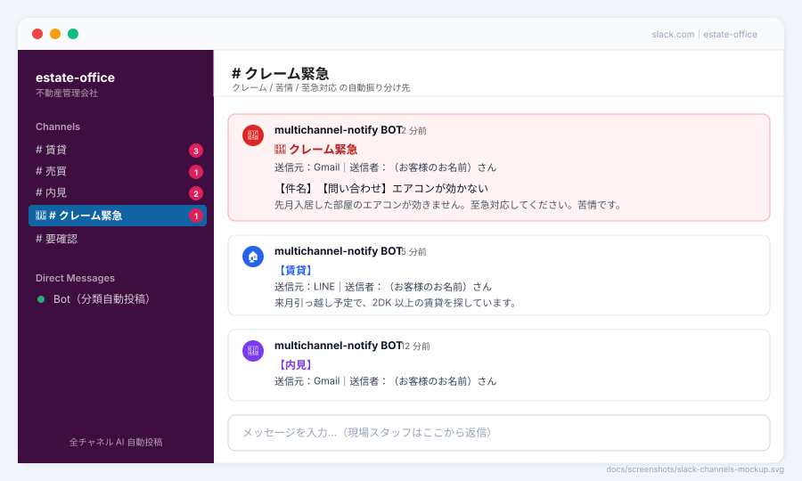
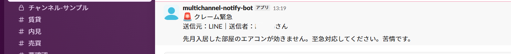
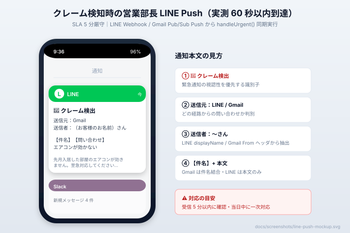
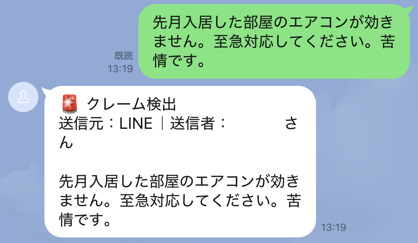

# マルチチャネル通知システム 運用マニュアル（詳細版・リポジトリ用）

**対象：** 営業部長・現場スタッフ（非エンジニア向け）
**用途：** 詳しい手順・SQL 例・トラブル対応まで一箇所で参照するための詳細版

> 📄 **現場に紙で配布・掲示したい場合は [`manual-operator-print.md`](./manual-operator-print.md)（A4 縦 1 枚版）** をご利用ください。日常運用に必要な最小限の情報だけに絞ってあります。

---

## 普段の確認（毎日）

**Slack の以下 5 チャネルを開くだけで OK です。** 個別に LINE や Gmail を確認する必要はありません。



**実際の Slack 画面（本番稼働中）：**

<p align="center">
  
</p>

> 実運用中の Slack ワークスペースのスクリーンショット。5 つのチャネルが自動で振り分けられ、各投稿の先頭に「送信元・送信者」ヘッダが付いていることが確認できます。

| チャネル | 何が来るか |
|---|---|
| `#賃貸` | 賃貸物件の問い合わせ |
| `#売買` | 売買物件の問い合わせ |
| `#内見` | 内見希望 |
| `#クレーム緊急` | クレーム（営業部長個人 LINE にも同時通知） |
| `#要確認` | AI が判断できなかったもの（目視で判断） |

**投稿の見方：** 1 行目に「送信元：LINE または Gmail｜送信者：〜さん」が付いています。誰からの問い合わせか一目で分かります。

---

## 緊急通知について

- **クレームを検知すると営業部長の個人 LINE に自動通知**が届きます
- **通知から 5 分以内**を目標としています（実測 1 分未満）
- Slack `#クレーム緊急` にも同時投稿されるので、現場スタッフも状況を共有できます
- 通知の先頭には **🚨 マーク**が付きます



**実際のスマホ受信画面（本番稼働中）：**

<p align="center">
  
</p>

> クレームキーワード（「至急」「苦情」等）を含むメッセージを送信すると、営業部長の個人 LINE に **数十秒〜1 分以内** に届きます。SLA 5 分目標に対して大幅に余裕を持って達成できていることが分かります。

---

## おかしいと感じたら（障害対応）

以下の順番で確認してください。

### 1. Slack に通知が来ない場合

- 5 分待っても来ない → **開発担当へ連絡**
- Slack アプリの通知設定（ミュート・通知オフ）を先に確認

### 2. 個人 LINE に通知が来ない場合

- LINE アプリの通知設定（公式アカウントのミュート）を確認
- それでも来ない → **開発担当へ連絡**

### 3. 開発担当への連絡時に伝える情報

1. **いつから通知が来ないか**（例：今朝 9 時から）
2. **最後に届いた通知の時刻**（Slack や LINE の履歴から確認）
3. **送信したメール・LINE の内容**（件名・送信者・時刻）

この 3 点があれば原因特定が早くなります。

---

## Supabase で未処理件数を確認する方法

**開発担当向け・月 1 回程度の定期確認用です。**
Supabase ダッシュボード → SQL Editor で以下を実行してください。

```sql
-- 直近 24 時間の処理状況確認
SELECT status, COUNT(*)
FROM inquiry_queue
WHERE created_at > NOW() - INTERVAL '24 hours'
GROUP BY status;
```

**期待値：** `notified`（Slack 投稿済み）が大部分。`pending` が 0〜数件なら正常。

```sql
-- 30 分以上未処理のまま滞留している件数
SELECT COUNT(*)
FROM inquiry_queue
WHERE status = 'pending'
  AND created_at < NOW() - INTERVAL '30 minutes';
```

**期待値：** 0 件。1 件でも出たら Cron が止まっている可能性 → 開発担当へ連絡。

---

## 補足：3 つのカテゴリ判定ルール

| カテゴリ | 判定基準 |
|---|---|
| **クレーム** | 「クレーム」「苦情」「至急」「緊急対応」「怒り」等のキーワード検出時。**迷ったらクレーム扱い（安全側）** |
| **賃貸 / 売買 / 内見** | AI（Gemini）が本文から自動判定 |
| **要確認・その他** | 上記に当てはまらない・迷惑メール・判断困難な内容 |

「クレームではありません」等の否定形は自動除外される仕組みになっています。
